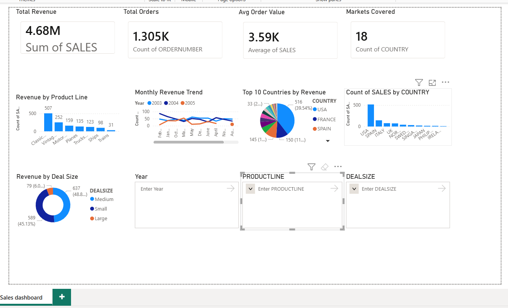

# Sales Performance Dashboard — Power BI

An interactive sales analytics dashboard built in Power BI analysing 2,800+ transactions across 18 countries and 7 product lines to track revenue KPIs, monthly trends, and market performance.

## Dashboard Preview
<!-- Add your screenshot here -->

## Key Insights
- Classic Cars drive the highest revenue among all product lines
- 44.6% of total revenue comes from Medium-sized deals
- USA is the top market by revenue, followed by Spain and France
- Peak sales months occur in October and November across all years

## Tools Used
`Power BI` `Power Query` `DAX` `Excel`

## Features
- KPI cards — Total Revenue, Total Orders, Avg Order Value, Markets Covered
- Interactive slicers filtering by Year, Product Line, and Deal Size
- Monthly revenue trend line chart by year
- Revenue breakdown by product line, country, and deal size

## Dataset
[Sample Sales Data — Kaggle](https://www.kaggle.com/datasets/kyanyoga/sample-sales-data)

## Author
**Diksha Jain** — [LinkedIn](https://linkedin.com/in/diksha-jain-a7819632a)
